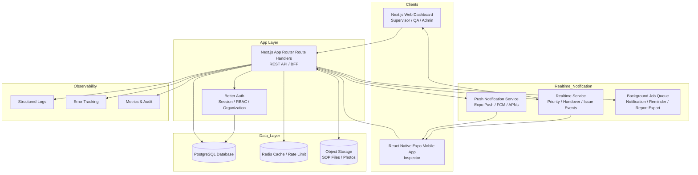
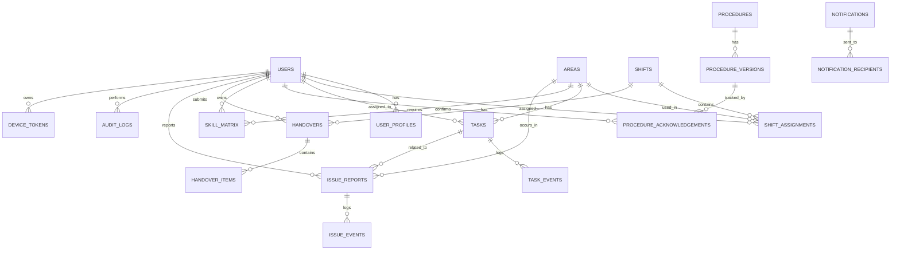

# PRD Final — Cladtek Quality Inspector

## Production-Ready Version with Utility UX & Eco-Mode Design

---

# 1. Product Overview

## 1.1 Nama Produk

**Cladtek Quality Inspector**

## 1.2 Ringkasan Produk

Cladtek Quality Inspector adalah aplikasi operasional berbasis **Web Dashboard** dan **Mobile App** untuk membantu tim Quality Inspector dalam mengatur jadwal kerja, pembagian manpower, prioritas inspeksi, rotasi area, update SOP, handover antar-shift, skill matrix, dan monitoring aktivitas inspector secara real-time.

Produk ini dirancang untuk lingkungan manufaktur dan migas, terutama produksi pipa, di mana kecepatan informasi, akurasi penugasan, dan dokumentasi operasional sangat penting.

Aplikasi ini menggunakan pendekatan **Utility UX & Eco-Mode Design**, yaitu desain yang berfokus pada efisiensi kerja, kecepatan pengambilan keputusan, tampilan bersih, minim distraksi, hemat data, hemat baterai, dan tetap nyaman digunakan di lapangan.

---

# 2. Problem Statement

Saat ini pengelolaan operasional Quality Inspector masih banyak dilakukan melalui komunikasi manual, pesan singkat, catatan terpisah, atau briefing langsung. Masalah utama yang muncul:

1. Informasi jadwal dan prioritas tidak selalu merata ke semua inspector.
2. Perubahan prioritas kerja sering terlambat diterima oleh tim lapangan.
3. Supervisor sulit melihat ketersediaan manpower secara cepat.
4. Skill setiap inspector terhadap area kerja belum terdokumentasi dengan baik.
5. Handover antar-shift rawan kehilangan informasi penting.
6. Update SOP belum memiliki bukti baca dan bukti pemahaman yang kuat.
7. Aktivitas operasional sulit diaudit karena tidak ada rekam jejak terpusat.
8. Penggunaan aplikasi lapangan harus tetap ringan karena inspector bekerja di kondisi fisik, bukan di meja kantor.

---

# 3. Product Goals

## 3.1 Tujuan Utama

Membangun sistem operasional Quality Inspector yang:

1. Mempercepat distribusi jadwal, prioritas, dan instruksi kerja.
2. Mengurangi komunikasi manual yang berulang.
3. Memastikan setiap inspector mengetahui tugas, area, dan prioritas hariannya.
4. Membantu supervisor mengatur manpower berdasarkan kebutuhan area dan skill.
5. Mencatat semua perubahan operasional dalam audit trail.
6. Memastikan pembaruan SOP terbaca dan terkonfirmasi.
7. Mempermudah handover antar-shift secara terstruktur.
8. Memberikan dashboard monitoring yang clean, cepat, dan actionable.

## 3.2 Prinsip Produk

Produk harus memenuhi prinsip berikut:

* **Fast First Win:** user langsung melihat informasi paling penting setelah login.
* **Minimal Cognitive Load:** tampilan tidak ramai, hanya menampilkan informasi yang dibutuhkan sesuai role.
* **Action-Oriented UI:** setiap layar harus mendorong aksi yang jelas.
* **Real-Time When Needed:** real-time hanya digunakan untuk data kritis seperti prioritas, emergency instruction, dan handover.
* **Offline-Friendly:** mobile app tetap dapat menampilkan jadwal terakhir dan menyimpan draft handover saat jaringan lemah.
* **Eco-Mode by Default:** hemat data, hemat baterai, minim animasi berat, dan tidak melakukan polling berlebihan.
* **Audit-Ready:** semua aktivitas penting tercatat otomatis.

---

# 4. Target Users & Roles

## 4.1 Role Pengguna

### 1. Super Admin

Bertanggung jawab atas konfigurasi sistem tingkat tinggi.

Hak akses:

* Mengelola perusahaan/site.
* Mengelola role dan permission.
* Mengelola master data global.
* Melihat seluruh audit log.
* Mengatur integrasi dan konfigurasi sistem.

### 2. QA Manager

Bertanggung jawab memantau performa quality operation secara keseluruhan.

Hak akses:

* Melihat dashboard semua shift.
* Melihat performa inspector dan area.
* Melihat compliance SOP.
* Melihat laporan dan tren operasional.
* Mengekspor laporan.

### 3. Supervisor / Leader

Bertanggung jawab atas operasional harian inspector.

Hak akses:

* Membuat dan mengatur jadwal shift.
* Assign inspector ke area.
* Mengubah prioritas kerja.
* Membuat task inspeksi.
* Mengirim broadcast instruksi.
* Mengunggah atau menerbitkan SOP.
* Melihat handover.
* Melihat skill matrix.
* Menyetujui atau menutup laporan issue.

### 4. Inspector

Pengguna utama di lapangan.

Hak akses:

* Melihat jadwal dan prioritas harian.
* Melihat area penugasan.
* Menerima notifikasi perubahan prioritas.
* Update status task.
* Membaca dan konfirmasi SOP.
* Membuat catatan handover.
* Melaporkan kendala/issue.
* Upload foto pendukung bila diperlukan.

### 5. Auditor / Viewer

Role read-only untuk pihak internal yang perlu memeriksa data.

Hak akses:

* Melihat laporan.
* Melihat audit trail.
* Melihat SOP acknowledgement.
* Tidak dapat mengubah data operasional.

---

# 5. Product Scope

## 5.1 In Scope

Fitur yang masuk dalam scope production:

1. Authentication dan role-based access control.
2. Web dashboard untuk Supervisor, QA Manager, dan Admin.
3. Mobile app untuk Inspector.
4. Manajemen jadwal shift.
5. Manajemen area inspeksi.
6. Manajemen task dan prioritas.
7. Real-time priority update.
8. Push notification.
9. SOP management dan acknowledgement.
10. Skill matrix inspector.
11. Rotation recommendation.
12. Handover antar-shift.
13. Issue reporting.
14. Audit trail.
15. Master data.
16. Reporting dan analytics.
17. Offline draft untuk mobile.
18. Eco-mode dan low data mode.
19. Export laporan.
20. Notification center.

## 5.2 Out of Scope untuk Versi Awal Production

Fitur yang tidak wajib di release pertama:

1. AI auto-scheduling penuh.
2. Integrasi mesin produksi secara langsung.
3. Computer vision untuk inspeksi otomatis.
4. Payroll atau absensi HR.
5. ERP integration penuh.
6. Predictive maintenance.
7. Multi-language selain Bahasa Indonesia dan English basic label.

---

# 6. Key Product Philosophy: Utility UX & Eco-Mode

## 6.1 Utility UX

Utility UX berarti desain tidak hanya terlihat modern, tetapi benar-benar membantu user menyelesaikan tugas lebih cepat.

Implementasi:

1. **Inspector Home = Today’s Mission**

   * Saat membuka mobile app, inspector langsung melihat:

     * Shift hari ini.
     * Area kerja.
     * Prioritas nomor 1.
     * Status SOP penting.
     * Tombol update status.
     * Tombol handover.

2. **Supervisor Dashboard = Command Center**

   * Supervisor langsung melihat:

     * Jumlah inspector aktif.
     * Area yang kekurangan manpower.
     * Task high priority.
     * Handover terakhir.
     * SOP belum dibaca.
     * Perubahan prioritas terbaru.

3. **No Decorative Clutter**

   * Hindari komponen yang hanya dekoratif.
   * Gunakan card, badge, icon, table, timeline, dan chart hanya jika membantu keputusan.

4. **Action Above Information**

   * Informasi penting selalu disertai action:

     * “Assign Inspector”
     * “Change Priority”
     * “Send Broadcast”
     * “Mark as Resolved”
     * “Request Acknowledgement”
     * “Create Handover”

5. **One-Handed Mobile Use**

   * Tombol utama berada di area mudah dijangkau.
   * Form mobile pendek.
   * Input handover mendukung template dan quick tags.

---

## 6.2 Eco-Mode Design

Eco-mode adalah pendekatan desain dan teknis untuk mengurangi beban device, jaringan, server, dan user.

Implementasi:

1. **Low Data Mode**

   * Gambar dikompresi otomatis.
   * Chart berat tidak dimuat di mobile inspector.
   * Data historis dimuat hanya saat diminta.
   * Infinite scroll dengan limit kecil.
   * Attachment SOP dapat di-cache.

2. **Battery-Friendly Mobile**

   * Tidak menggunakan polling agresif.
   * Real-time hanya aktif pada channel penting.
   * Background sync dibatasi.
   * Animasi minim dan ringan.
   * Push notification menggantikan refresh manual.

3. **Eco UI**

   * Mendukung dark mode.
   * Mendukung compact mode.
   * Mengurangi warna berlebihan.
   * Menggunakan status color secara konsisten.

4. **Efficient Backend**

   * Query database dioptimasi dengan index.
   * Pagination wajib untuk list besar.
   * Audit log menggunakan struktur append-only.
   * Job background untuk notifikasi massal.
   * Cache untuk master data.

---

# 7. Core Features

---

## 7.1 Authentication & Authorization

### Description

Sistem harus memiliki autentikasi aman dan role-based access control.

### Functional Requirements

1. User login menggunakan email dan password.
2. Optional: login menggunakan employee ID.
3. Role minimal:

   * Super Admin
   * QA Manager
   * Supervisor
   * Inspector
   * Auditor
4. Setiap route dan API harus divalidasi berdasarkan permission.
5. Session harus memiliki expiry.
6. User yang tidak aktif dapat dinonaktifkan.
7. Semua login, logout, failed login, dan perubahan role dicatat di audit log.

### Acceptance Criteria

* User tidak bisa mengakses halaman di luar role-nya.
* Inspector tidak bisa membuka menu assignment management.
* Supervisor tidak bisa mengubah konfigurasi global.
* Semua perubahan role tercatat di audit log.

---

## 7.2 Inspector Mobile Home — Today’s Mission

### Description

Halaman utama mobile untuk inspector harus menjadi pusat informasi harian.

### Data yang Ditampilkan

1. Nama inspector.
2. Shift aktif.
3. Jam mulai dan selesai shift.
4. Area kerja.
5. Prioritas utama.
6. Daftar task aktif.
7. SOP baru yang wajib dibaca.
8. Handover dari shift sebelumnya.
9. Status koneksi.
10. Tombol quick action.

### UI Requirements

* Header sederhana: nama, shift, status koneksi.
* Card utama: “Prioritas Saat Ini”.
* Badge status:

  * High Priority
  * Updated
  * Pending SOP
  * Handover Required
* Bottom navigation:

  * Home
  * Tasks
  * SOP
  * Handover
  * Profile

### Quick Actions

* Start Task
* Update Progress
* Mark Blocked
* Add Note
* Create Handover
* Confirm SOP

### Acceptance Criteria

* Inspector bisa mengetahui tugas utamanya dalam maksimal 5 detik setelah membuka app.
* Semua action utama dapat diakses maksimal 2 tap.
* Jika offline, jadwal terakhir tetap tampil.

---

## 7.3 Shift & Schedule Management

### Description

Supervisor dapat membuat dan mengatur jadwal shift inspector.

### Functional Requirements

1. Sistem mendukung minimal:

   * Shift Pagi
   * Shift Malam
2. Sistem dapat dikembangkan untuk:

   * Shift Sore
   * Custom shift
   * Overtime
3. Supervisor dapat assign inspector ke area tertentu.
4. Supervisor dapat melihat conflict:

   * Inspector double assignment.
   * Inspector sedang cuti/nonaktif.
   * Area belum memiliki inspector.
   * Skill inspector tidak cocok dengan area.
5. Supervisor dapat duplicate jadwal dari hari sebelumnya.
6. Supervisor dapat membuat template shift.
7. Perubahan jadwal wajib memiliki reason.
8. Semua perubahan jadwal masuk audit trail.

### Web UI Requirements

* Calendar view.
* Shift board view.
* Drag-and-drop assignment.
* Filter by area, shift, skill, status.
* Warning badge untuk conflict.
* Bulk assign untuk banyak inspector.

### Acceptance Criteria

* Supervisor bisa membuat jadwal harian tanpa refresh page.
* Sistem memberi warning jika ada assignment bermasalah.
* Inspector menerima update jadwal setelah supervisor publish.

---

## 7.4 Task & Priority Management

### Description

Task digunakan untuk mengatur pekerjaan inspeksi dalam setiap shift.

### Task Status

1. Draft
2. Assigned
3. Acknowledged
4. In Progress
5. Blocked
6. Done
7. Verified
8. Closed
9. Cancelled

### Priority Level

1. Critical
2. High
3. Medium
4. Low

### Functional Requirements

1. Supervisor dapat membuat task untuk area tertentu.
2. Supervisor dapat mengubah prioritas task.
3. Inspector menerima notifikasi saat prioritas berubah.
4. Inspector harus acknowledge perubahan prioritas.
5. Task dapat memiliki due time.
6. Task dapat memiliki attachment.
7. Task dapat memiliki checklist.
8. Task dapat memiliki catatan progres.
9. Task critical harus muncul paling atas.
10. Setiap perubahan status dicatat sebagai task event.

### UI Requirements

* Priority board menggunakan layout Kanban atau list compact.
* Critical task menggunakan visual kuat tetapi tidak berlebihan.
* Task card menampilkan:

  * Area
  * Priority
  * Status
  * Assigned inspector
  * Due time
  * Last update
* Supervisor dapat reorder priority dengan drag-and-drop.
* Mobile inspector hanya melihat task yang relevan untuk dirinya.

### Acceptance Criteria

* Perubahan prioritas muncul di mobile inspector tanpa perlu logout.
* Setiap perubahan prioritas memiliki timestamp dan actor.
* Inspector dapat menandai task blocked dengan alasan.

---

## 7.5 Real-Time Priority Update

### Description

Fitur untuk memastikan perubahan prioritas diterima inspector secara cepat.

### Functional Requirements

1. Supervisor mengubah prioritas dari dashboard.
2. Sistem mengirim update ke inspector terkait.
3. Mobile app menampilkan banner:

   * “Prioritas berubah”
   * “Area berubah”
   * “Task baru ditambahkan”
4. Inspector wajib menekan “Acknowledge”.
5. Jika inspector belum acknowledge dalam batas waktu tertentu, sistem menampilkan escalation status ke supervisor.
6. Supervisor dapat melihat siapa yang sudah menerima dan acknowledge.

### Notification Type

* Push notification.
* In-app notification.
* Dashboard alert.
* Optional: email untuk non-urgent report.

### Acceptance Criteria

* Inspector menerima notifikasi perubahan prioritas.
* Supervisor dapat melihat status acknowledgement.
* Semua notification event tercatat.

---

## 7.6 SOP & Procedure Management

### Description

Sistem menyimpan, mendistribusikan, dan melacak pembacaan SOP.

### Functional Requirements

1. Supervisor atau QA Manager dapat membuat SOP.
2. SOP mendukung versioning.
3. SOP dapat berupa:

   * Rich text
   * PDF
   * Link internal
   * Attachment image
4. SOP dapat ditargetkan ke:

   * Semua inspector
   * Inspector area tertentu
   * Shift tertentu
   * Skill level tertentu
5. SOP dapat diberi kategori:

   * Safety
   * Inspection Method
   * Production Update
   * Emergency Instruction
   * General Announcement
6. Inspector wajib klik:

   * “Telah Dibaca”
   * “Saya Pahami”
7. Untuk SOP critical, sistem dapat meminta confirmation checkbox tambahan.
8. Supervisor dapat melihat daftar user yang belum membaca SOP.
9. SOP tidak boleh dihapus permanen jika sudah dipublish; gunakan archive.

### SOP Status

1. Draft
2. In Review
3. Published
4. Archived

### Acceptance Criteria

* Setiap SOP memiliki versi.
* Inspector hanya melihat SOP yang relevan.
* Bukti baca tersimpan dengan timestamp.
* SOP critical muncul sebagai blocking prompt sebelum inspector lanjut ke task.

---

## 7.7 Skill Matrix Management

### Description

Skill Matrix digunakan untuk memetakan kemampuan inspector terhadap area inspeksi.

### Skill Level

1. Not Trained
2. Beginner
3. Intermediate
4. Competent
5. Expert
6. Trainer

### Functional Requirements

1. Supervisor dapat mengelola skill inspector per area.
2. Setiap skill memiliki:

   * Level
   * Area
   * Last assessment date
   * Assessor
   * Evidence/notes
3. Sistem memberi rekomendasi assignment berdasarkan skill.
4. Sistem memberi warning jika inspector ditempatkan di area yang belum memenuhi skill minimum.
5. Sistem dapat menampilkan gap skill per area.
6. Sistem dapat menampilkan inspector yang perlu rotasi/training.

### UI Requirements

* Matrix table dengan inspector sebagai row dan area sebagai column.
* Warna skill harus konsisten dan tidak terlalu ramai.
* Filter:

  * By area
  * By inspector
  * By level
  * By due assessment
* Export ke Excel/PDF.

### Acceptance Criteria

* Supervisor dapat melihat skill gap dalam satu halaman.
* Assignment dapat divalidasi berdasarkan minimum skill.
* Perubahan skill tercatat di audit log.

---

## 7.8 Rotation Recommendation

### Description

Sistem membantu supervisor melakukan rotasi area agar skill inspector merata.

### Functional Requirements

1. Sistem menganalisis histori assignment.
2. Sistem menampilkan inspector yang terlalu lama di area yang sama.
3. Sistem merekomendasikan rotasi berdasarkan:

   * Skill level
   * Area exposure
   * Availability
   * Shift
   * Minimum requirement area
4. Supervisor tetap menjadi decision maker.
5. Rekomendasi dapat diterima, diubah, atau ditolak.
6. Alasan penolakan rekomendasi dapat dicatat.

### Rotation Rule Example

* Inspector tidak boleh berada di area yang sama lebih dari X hari berturut-turut.
* Area critical minimal diisi oleh 1 inspector level Competent atau lebih.
* Inspector Beginner harus didampingi inspector Expert/Trainer.

### Acceptance Criteria

* Sistem memberikan rekomendasi rotasi, bukan auto-assign sepenuhnya.
* Supervisor dapat override rekomendasi.
* Override tersimpan di audit log.

---

## 7.9 Handover Shift

### Description

Handover memastikan informasi dari shift sebelumnya diterima shift berikutnya secara lengkap.

### Functional Requirements

1. Inspector wajib membuat handover di akhir shift.
2. Handover dapat dibuat per:

   * Area
   * Shift
   * Task
   * Issue
3. Handover memiliki template:

   * Kondisi area
   * Pekerjaan selesai
   * Pekerjaan pending
   * Kendala
   * Safety concern
   * Catatan khusus
4. Handover dapat memiliki attachment foto.
5. Shift berikutnya wajib acknowledge handover.
6. Supervisor dapat melihat handover yang belum lengkap.
7. Sistem memberikan reminder sebelum shift selesai.

### Handover Status

1. Draft
2. Submitted
3. Read by Next Shift
4. Acknowledged
5. Closed

### Mobile UI Requirements

* Form handover singkat.
* Quick tags:

  * Normal
  * Pending
  * Need Follow-up
  * Safety Concern
  * Quality Issue
  * Machine/Line Issue
* Voice-to-text optional untuk mempercepat input.

### Acceptance Criteria

* Inspector dapat membuat handover dalam waktu singkat.
* Shift berikutnya dapat membaca handover sebelum mulai task.
* Supervisor dapat melihat handover incomplete.

---

## 7.10 Issue Reporting

### Description

Inspector dapat melaporkan kendala atau kondisi abnormal di lapangan.

### Issue Category

1. Quality Issue
2. Safety Concern
3. Manpower Shortage
4. Equipment Issue
5. SOP Deviation
6. Production Constraint
7. Other

### Issue Severity

1. Critical
2. High
3. Medium
4. Low

### Functional Requirements

1. Inspector dapat membuat issue report dari mobile.
2. Issue dapat memiliki foto.
3. Issue dapat dikaitkan dengan area, task, atau shift.
4. Supervisor menerima alert untuk issue High dan Critical.
5. Supervisor dapat mengubah status issue.
6. Issue dapat dimasukkan ke handover.
7. Semua update issue tercatat.

### Issue Status

1. Open
2. Under Review
3. Action Required
4. Resolved
5. Closed
6. Rejected

### Acceptance Criteria

* Issue critical langsung muncul di dashboard supervisor.
* Issue dapat difilter berdasarkan area, shift, severity, dan status.
* Foto issue dapat dilihat dengan jelas namun tetap dikompresi untuk mobile.

---

## 7.11 Notification Center

### Description

Sistem memiliki pusat notifikasi agar user tidak kehilangan update penting.

### Notification Type

1. Schedule Update
2. Priority Change
3. New SOP
4. SOP Reminder
5. Handover Reminder
6. Issue Alert
7. Assignment Change
8. System Alert

### Notification Channel

1. Push notification
2. In-app notification
3. Dashboard toast
4. Email untuk report tertentu
5. Optional: WhatsApp gateway untuk tahap lanjutan

### Notification Priority

1. Critical
2. High
3. Normal
4. Low

### Functional Requirements

1. User dapat melihat semua notifikasi.
2. User dapat mark as read.
3. Notifikasi critical tidak bisa hilang sebelum dibuka.
4. Supervisor dapat melihat delivery dan acknowledgement status.
5. Sistem menghindari spam notification.
6. Notifikasi digabung jika event terlalu banyak dalam waktu singkat.

### Acceptance Criteria

* Inspector tidak menerima notifikasi yang tidak relevan.
* Critical notification muncul jelas.
* Semua notification event tersimpan.

---

## 7.12 Audit Trail

### Description

Audit trail mencatat aktivitas penting untuk kebutuhan compliance dan investigasi.

### Event yang Wajib Dicatat

1. Login/logout.
2. Failed login.
3. Create/update/delete/archive data.
4. Publish SOP.
5. SOP acknowledgement.
6. Assignment change.
7. Priority change.
8. Task status update.
9. Handover submit.
10. Issue status update.
11. Role/permission change.
12. Export report.

### Audit Log Data

* Actor user ID
* Actor name
* Role
* Action
* Entity type
* Entity ID
* Before value
* After value
* Timestamp
* IP address
* Device info
* Reason, jika ada

### Acceptance Criteria

* Audit log tidak bisa diedit dari UI.
* Audit log dapat difilter.
* Audit log dapat diekspor oleh role tertentu.

---

## 7.13 Reporting & Analytics

### Description

Dashboard laporan membantu manager dan supervisor melihat performa operasional.

### Report Modules

1. Shift completion report.
2. Task completion report.
3. SOP compliance report.
4. Handover completion report.
5. Issue trend report.
6. Area coverage report.
7. Skill gap report.
8. Inspector workload report.
9. Rotation history report.

### Web Dashboard Widgets

1. Active inspectors today.
2. Open critical tasks.
3. Area coverage status.
4. SOP unread count.
5. Handover pending count.
6. Issue severity chart.
7. Task completion trend.
8. Skill matrix heatmap.
9. Priority change timeline.

### UI Requirements

* Chart harus interaktif tetapi tidak berlebihan.
* Dashboard harus memiliki compact mode.
* Data default menampilkan hari ini.
* Filter:

  * Date range
  * Shift
  * Area
  * Inspector
  * Status
  * Severity
* Export:

  * PDF
  * Excel/CSV

### Acceptance Criteria

* Supervisor dapat melihat kondisi shift hari ini dalam satu layar.
* QA Manager dapat melihat tren mingguan/bulanan.
* Report tidak memperlambat halaman utama.

---

## 7.14 Master Data Management

### Master Data yang Dibutuhkan

1. Area produksi.
2. Line produksi.
3. Shift type.
4. Job category.
5. Inspection type.
6. Skill level.
7. SOP category.
8. Issue category.
9. Issue severity.
10. Task priority.
11. Department.
12. Position.
13. Site/location.
14. Equipment atau station, jika diperlukan.

### Functional Requirements

1. Hanya Admin atau role tertentu yang bisa mengubah master data.
2. Master data yang sudah digunakan tidak boleh dihapus permanen.
3. Gunakan status active/inactive.
4. Perubahan master data tercatat di audit log.

### Acceptance Criteria

* Master data dapat digunakan ulang di seluruh modul.
* Tidak ada hardcoded area/shift/status di aplikasi.
* Data lama tetap aman walaupun master data dinonaktifkan.

---

# 8. User Flows

---

## 8.1 Inspector Mobile Flow

### Flow 1 — Start Shift

1. Inspector login.
2. Sistem menampilkan Today’s Mission.
3. Inspector membaca handover dari shift sebelumnya.
4. Inspector melihat area dan task prioritas.
5. Inspector klik “Start Shift”.
6. Status inspector menjadi active.

### Flow 2 — Execute Task

1. Inspector membuka task.
2. Inspector klik “Start Task”.
3. Inspector melakukan inspeksi di area.
4. Inspector update status:

   * In Progress
   * Blocked
   * Done
5. Jika blocked, inspector wajib mengisi alasan.
6. Jika done, inspector dapat menambahkan catatan/foto.

### Flow 3 — Priority Change

1. Supervisor mengubah prioritas.
2. Inspector menerima push notification.
3. Mobile app menampilkan priority banner.
4. Inspector klik “Acknowledge”.
5. Task list otomatis reorder.
6. Audit trail mencatat acknowledgement.

### Flow 4 — SOP Update

1. Inspector menerima notifikasi SOP baru.
2. Inspector membuka SOP.
3. Inspector membaca SOP.
4. Inspector klik “Telah Dibaca & Dipahami”.
5. Sistem menyimpan timestamp.

### Flow 5 — End Shift & Handover

1. Inspector menerima reminder sebelum shift selesai.
2. Inspector membuka form handover.
3. Inspector mengisi ringkasan.
4. Inspector menambahkan issue pending jika ada.
5. Inspector submit handover.
6. Shift berikutnya menerima handover.

---

## 8.2 Supervisor Web Flow

### Flow 1 — Daily Planning

1. Supervisor login.
2. Dashboard menampilkan kondisi hari ini.
3. Supervisor membuka shift planner.
4. Supervisor assign inspector ke area.
5. Sistem memberi warning jika ada conflict.
6. Supervisor publish jadwal.
7. Inspector menerima notifikasi.

### Flow 2 — Change Priority

1. Supervisor membuka priority board.
2. Supervisor drag task atau ubah priority.
3. Supervisor wajib mengisi reason.
4. Sistem mengirim notifikasi ke inspector terkait.
5. Supervisor memantau acknowledgement.

### Flow 3 — SOP Broadcast

1. Supervisor membuat SOP atau update prosedur.
2. Supervisor menentukan target audience.
3. Supervisor publish SOP.
4. Inspector menerima notifikasi.
5. Supervisor memantau read compliance.

### Flow 4 — Monitor Shift

1. Supervisor membuka command center.
2. Supervisor melihat task progress.
3. Supervisor melihat issue critical.
4. Supervisor melihat handover pending.
5. Supervisor melakukan follow-up.

---

# 9. UI/UX Specification

---

## 9.1 Design Direction

Tampilan harus clean, modern, industrial, dan efisien. Hindari dashboard yang terlalu ramai.

Karakter desain:

* Clean layout.
* High readability.
* Strong hierarchy.
* Compact but not cramped.
* Industrial color tone.
* Clear status badge.
* Minimal animation.
* Responsive.
* Touch-friendly untuk mobile.

---

## 9.2 Color System

### Primary

* Deep Blue / Slate Blue untuk trust dan operational command.

### Neutral

* White
* Slate
* Zinc
* Gray

### Status Color

* Critical: Red
* High: Orange
* Medium: Yellow/Amber
* Low: Blue/Gray
* Success: Green
* Info: Blue
* Warning: Amber
* Disabled: Gray

### Eco-Mode Color

* Dark background.
* Reduced brightness.
* High contrast text.
* Minimal gradient.
* Status color tetap terlihat jelas.

---

## 9.3 Typography

* Font modern sans-serif.
* Heading tegas.
* Body text minimal 14px web dan 15–16px mobile.
* Line height nyaman untuk membaca SOP.
* Gunakan angka tabular untuk dashboard/table.

---

## 9.4 Layout Web Dashboard

### Main Navigation

Sidebar:

1. Dashboard
2. Shift Planner
3. Tasks & Priority
4. Inspectors
5. Skill Matrix
6. SOP
7. Handover
8. Issues
9. Reports
10. Master Data
11. Audit Logs
12. Settings

### Dashboard Structure

1. Top KPI cards.
2. Active shift board.
3. Critical task panel.
4. Area coverage map/table.
5. SOP compliance widget.
6. Handover timeline.
7. Issue alert panel.

### UI Pattern

* Use card-based layout.
* Use table for dense data.
* Use command palette for quick search.
* Use drawer for detail view.
* Use modal only for confirmation.
* Use toast for lightweight feedback.
* Use badge for status.

---

## 9.5 Layout Mobile App

### Bottom Navigation

1. Home
2. Tasks
3. SOP
4. Handover
5. Profile

### Home Screen

* Today’s Mission card.
* Current priority.
* Shift time.
* Area.
* SOP pending.
* Handover from previous shift.
* Quick action buttons.

### Mobile Design Rules

* Maksimal 2 primary action per screen.
* Jangan gunakan table kompleks di mobile.
* Gunakan card list.
* Gunakan sticky CTA untuk action penting.
* Offline indicator harus terlihat.
* Form harus pendek dan bertahap.

---

# 10. Notification UX

## 10.1 Toast Notification

Digunakan untuk:

* Data berhasil disimpan.
* Task berhasil diupdate.
* SOP berhasil dikonfirmasi.
* Draft tersimpan.

## 10.2 Modal Confirmation

Digunakan untuk:

* Publish jadwal.
* Publish SOP.
* Change priority critical.
* Close issue.
* Archive SOP.

## 10.3 Badge Notification

Digunakan untuk:

* SOP unread.
* Handover pending.
* Issue open.
* Task blocked.

## 10.4 Loading State

* Gunakan skeleton ringan.
* Hindari spinner penuh layar kecuali login.
* Gunakan optimistic update untuk action sederhana.

## 10.5 Error State

Error harus jelas dan actionable.

Contoh:

* “Gagal menyimpan karena koneksi terputus. Data disimpan sebagai draft.”
* “Anda tidak memiliki akses untuk mengubah prioritas.”
* “Task sudah ditutup oleh Supervisor.”

---

# 11. Architecture

## 11.1 Recommended Production Architecture

---

## 11.2 Architecture Principles

1. Frontend dan backend tetap dalam satu monorepo untuk efisiensi development.
2. Backend API menggunakan route handlers.
3. Database utama menggunakan PostgreSQL.
4. Semua write operation penting menghasilkan audit log.
5. Real-time event tidak menggantikan database; database tetap source of truth.
6. Mobile app menggunakan local cache untuk offline-read dan draft.
7. File SOP dan foto issue disimpan di object storage.
8. Notification worker memproses pengiriman push secara asynchronous.

---

# 12. Recommended Tech Stack

## 12.1 Web Frontend

* Next.js App Router
* React
* TypeScript
* Tailwind CSS
* shadcn/ui
* TanStack Query
* Zustand atau Jotai untuk state ringan
* React Hook Form
* Zod validation
* Recharts atau Tremor untuk dashboard chart

## 12.2 Mobile App

* React Native
* Expo
* TypeScript
* Expo Notifications
* AsyncStorage atau SQLite local cache
* TanStack Query persistence
* React Hook Form
* Zod validation

## 12.3 Backend

* Next.js Route Handlers
* REST API
* Better Auth
* Drizzle ORM
* Zod server validation
* Background job untuk notification dan reminder

## 12.4 Database

Production:

* PostgreSQL

Pilihan provider:

* Supabase PostgreSQL
* Neon PostgreSQL
* Railway PostgreSQL
* Managed PostgreSQL internal perusahaan

Development local:

* PostgreSQL Docker
* SQLite hanya boleh digunakan untuk prototype kecil, bukan production utama.

## 12.5 Realtime

Pilihan:

* Supabase Realtime Broadcast
* Ably
* Pusher
* Custom WebSocket service jika infrastruktur mendukung

Recommended:

* Supabase Realtime Broadcast jika database menggunakan Supabase PostgreSQL.

## 12.6 Storage

* Supabase Storage
* S3-compatible storage
* Cloudflare R2

Digunakan untuk:

* SOP attachment
* Issue photos
* Handover photos
* Exported reports

## 12.7 Deployment

* Web + API: Vercel
* Mobile: EAS Build
* Database: Managed PostgreSQL
* Storage: Supabase Storage / S3 / R2
* Error tracking: Sentry
* Analytics/logging: PostHog / OpenTelemetry / provider internal

---

# 13. Database Schema

## 13.1 Entity Relationship Diagram

---

## 13.2 Core Tables

### users

Menyimpan data autentikasi dasar. Tabel auth detail dapat mengikuti struktur library auth.

Fields:

* id
* name
* email
* employee_id
* role
* status
* created_at
* updated_at

### user_profiles

Menyimpan detail pegawai.

Fields:

* id
* user_id
* department_id
* position
* phone
* avatar_url
* join_date
* active_site_id

### areas

Master area inspeksi.

Fields:

* id
* code
* name
* description
* site_id
* minimum_skill_level
* status
* created_at
* updated_at

### shifts

Master shift.

Fields:

* id
* name
* start_time
* end_time
* timezone
* status

### shift_assignments

Penugasan inspector ke shift dan area.

Fields:

* id
* user_id
* shift_id
* area_id
* work_date
* assignment_status
* published_at
* published_by
* change_reason
* created_at
* updated_at

### tasks

Pekerjaan inspeksi.

Fields:

* id
* title
* description
* area_id
* assigned_user_id
* shift_assignment_id
* priority
* status
* due_at
* created_by
* updated_by
* created_at
* updated_at
* closed_at

### task_events

Riwayat perubahan task.

Fields:

* id
* task_id
* event_type
* old_value
* new_value
* reason
* actor_id
* created_at

### skill_matrix

Skill inspector per area.

Fields:

* id
* user_id
* area_id
* skill_level
* assessed_by
* assessed_at
* valid_until
* notes
* created_at
* updated_at

### procedures

Dokumen SOP utama.

Fields:

* id
* title
* category
* status
* owner_id
* created_at
* updated_at
* archived_at

### procedure_versions

Versi SOP.

Fields:

* id
* procedure_id
* version_number
* content
* attachment_url
* published_at
* published_by
* effective_date
* is_critical

### procedure_acknowledgements

Bukti baca SOP.

Fields:

* id
* procedure_version_id
* user_id
* acknowledged_at
* acknowledgement_type
* device_info

### handovers

Header handover antar-shift.

Fields:

* id
* from_shift_assignment_id
* to_shift_id
* area_id
* submitted_by
* status
* submitted_at
* acknowledged_by
* acknowledged_at

### handover_items

Detail handover.

Fields:

* id
* handover_id
* category
* note
* severity
* attachment_url
* related_task_id
* related_issue_id

### issue_reports

Laporan issue lapangan.

Fields:

* id
* title
* description
* category
* severity
* status
* area_id
* task_id
* shift_assignment_id
* reported_by
* assigned_to
* attachment_url
* created_at
* updated_at
* closed_at

### issue_events

Riwayat issue.

Fields:

* id
* issue_id
* event_type
* old_value
* new_value
* note
* actor_id
* created_at

### notifications

Header notifikasi.

Fields:

* id
* title
* message
* type
* priority
* entity_type
* entity_id
* created_by
* created_at

### notification_recipients

Status penerima notifikasi.

Fields:

* id
* notification_id
* user_id
* delivery_status
* read_at
* acknowledged_at
* delivered_at

### device_tokens

Token device untuk push notification.

Fields:

* id
* user_id
* platform
* token
* device_name
* last_active_at
* created_at

### audit_logs

Audit trail.

Fields:

* id
* actor_id
* action
* entity_type
* entity_id
* before_value
* after_value
* reason
* ip_address
* user_agent
* created_at

---

# 14. API Specification

## 14.1 Auth

* POST `/api/auth/login`
* POST `/api/auth/logout`
* GET `/api/auth/session`
* GET `/api/me`

## 14.2 Users & Inspectors

* GET `/api/users`
* GET `/api/users/:id`
* PATCH `/api/users/:id`
* GET `/api/inspectors`
* GET `/api/inspectors/:id/skills`

## 14.3 Areas

* GET `/api/areas`
* POST `/api/areas`
* PATCH `/api/areas/:id`
* PATCH `/api/areas/:id/archive`

## 14.4 Shifts & Assignments

* GET `/api/shifts`
* GET `/api/shift-assignments`
* POST `/api/shift-assignments`
* PATCH `/api/shift-assignments/:id`
* POST `/api/shift-assignments/publish`
* POST `/api/shift-assignments/duplicate`

## 14.5 Tasks

* GET `/api/tasks`
* POST `/api/tasks`
* GET `/api/tasks/:id`
* PATCH `/api/tasks/:id`
* PATCH `/api/tasks/:id/status`
* PATCH `/api/tasks/:id/priority`
* POST `/api/tasks/:id/acknowledge`

## 14.6 SOP

* GET `/api/procedures`
* POST `/api/procedures`
* GET `/api/procedures/:id`
* POST `/api/procedures/:id/versions`
* POST `/api/procedure-versions/:id/publish`
* POST `/api/procedure-versions/:id/acknowledge`

## 14.7 Handover

* GET `/api/handovers`
* POST `/api/handovers`
* GET `/api/handovers/:id`
* POST `/api/handovers/:id/acknowledge`

## 14.8 Issues

* GET `/api/issues`
* POST `/api/issues`
* GET `/api/issues/:id`
* PATCH `/api/issues/:id/status`
* POST `/api/issues/:id/comment`

## 14.9 Notifications

* GET `/api/notifications`
* PATCH `/api/notifications/:id/read`
* PATCH `/api/notifications/:id/acknowledge`

## 14.10 Reports

* GET `/api/reports/shift-completion`
* GET `/api/reports/task-completion`
* GET `/api/reports/sop-compliance`
* GET `/api/reports/skill-gap`
* GET `/api/reports/issues`
* POST `/api/reports/export`

---

# 15. Security Requirements

1. Semua endpoint harus membutuhkan session valid kecuali login.
2. Role dan permission dicek di server, bukan hanya di UI.
3. Gunakan HTTPS.
4. Password harus di-hash oleh auth provider/library.
5. Sensitive action membutuhkan audit log.
6. File upload harus divalidasi:

   * file type
   * file size
   * malware scanning optional
7. Gunakan signed URL untuk file private.
8. Rate limit untuk login dan endpoint sensitif.
9. Gunakan CSRF protection sesuai mekanisme auth.
10. Gunakan input validation dengan schema.
11. Jangan expose internal error ke client.
12. Backup database terjadwal.
13. Data penting tidak boleh hard delete.

---

# 16. Performance Requirements

## 16.1 Web

* Dashboard awal harus terasa cepat.
* Data berat dimuat bertahap.
* Table menggunakan pagination.
* Filter menggunakan debounce.
* Chart tidak dimuat jika tab tidak aktif.
* Export report diproses async jika data besar.

## 16.2 Mobile

* Home screen harus bisa tampil dari cache.
* App tetap berguna saat koneksi lemah.
* Upload foto dikompresi.
* Draft handover disimpan lokal.
* Sinkronisasi dilakukan saat koneksi kembali stabil.

## 16.3 Backend

* Semua query list harus pagination.
* Index wajib untuk:

  * user_id
  * area_id
  * shift_id
  * work_date
  * status
  * priority
  * created_at
* Gunakan transaction untuk operasi penting:

  * publish schedule
  * change priority
  * SOP publish
  * handover submit
* Gunakan background job untuk:

  * push notification
  * report export
  * reminder
  * escalation

---

# 17. Offline & Sync Requirements

## 17.1 Offline Read

Mobile app harus tetap menampilkan:

* Jadwal terakhir.
* Task terakhir.
* SOP yang sudah di-cache.
* Handover terakhir.
* Profile user.

## 17.2 Offline Draft

Mobile app harus bisa menyimpan:

* Draft handover.
* Draft issue report.
* Draft task note.

## 17.3 Sync Behavior

Saat koneksi kembali:

1. App mengirim draft yang belum tersinkron.
2. Jika terjadi conflict, user diberi pilihan:

   * Keep local draft
   * Replace with server data
   * Merge manually
3. Semua sync error tampil jelas.

---

# 18. Eco-Mode Requirements

## 18.1 User-Controlled Eco Mode

User dapat mengaktifkan Eco Mode dari profile/settings.

Saat aktif:

* Animasi dikurangi.
* Gambar dimuat dalam kualitas rendah terlebih dahulu.
* Chart berat tidak otomatis dimuat di mobile.
* Refresh otomatis dibatasi.
* Background sync dikurangi.
* Dark mode disarankan.

## 18.2 Automatic Eco Behavior

Sistem otomatis masuk mode hemat ketika:

* Battery rendah.
* Koneksi lambat.
* App berada di background.
* User berada di halaman yang tidak membutuhkan real-time.

## 18.3 Technical Eco Rules

* Hindari polling jika real-time event tersedia.
* Gunakan cache untuk master data.
* Gunakan pagination.
* Kompres attachment.
* Lazy load module.
* Gunakan server-side filtering.
* Batasi payload API.

---

# 19. Data Retention & Compliance

1. Audit log disimpan minimal sesuai kebijakan perusahaan.
2. SOP version tidak boleh dihapus permanen.
3. Assignment history disimpan.
4. Handover history disimpan.
5. Issue report disimpan dengan status final.
6. File lama dapat diarsipkan, bukan langsung dihapus.
7. Export data hanya bisa dilakukan role tertentu.
8. Semua export dicatat di audit log.

---

# 20. Success Metrics

## 20.1 Operational Metrics

1. Waktu supervisor membuat jadwal harian berkurang.
2. Jumlah missed handover berkurang.
3. Jumlah inspector yang tidak membaca SOP berkurang.
4. Perubahan prioritas lebih cepat diterima inspector.
5. Konflik assignment berkurang.
6. Area coverage lebih merata.

## 20.2 Product Metrics

1. Daily active inspector.
2. Task acknowledgement rate.
3. SOP acknowledgement rate.
4. Handover completion rate.
5. Push notification delivery rate.
6. Offline draft sync success rate.
7. Average task update time.
8. Error rate mobile dan web.

---

# 21. MVP Production Release Scope

## Phase 1 — Production MVP

Fitur wajib untuk release pertama:

1. Auth dan RBAC.
2. Web dashboard supervisor.
3. Mobile inspector home.
4. Shift assignment.
5. Task dan priority management.
6. Push notification priority change.
7. SOP publish dan acknowledgement.
8. Handover shift.
9. Skill matrix basic.
10. Issue reporting basic.
11. Audit trail.
12. Master data area dan shift.
13. Basic report.
14. Offline cache dan draft handover.
15. Eco-mode basic.

## Phase 2 — Optimization

1. Rotation recommendation advanced.
2. Advanced reporting.
3. Skill gap analytics.
4. Escalation automation.
5. Bulk operation.
6. Export report async.
7. Advanced notification analytics.

## Phase 3 — Enterprise

1. Integration dengan ERP/MES.
2. SSO perusahaan.
3. Advanced compliance module.
4. AI-assisted scheduling.
5. Predictive workload balancing.
6. Multi-site enterprise dashboard.

---

# 22. Acceptance Criteria Global

Aplikasi dianggap siap production jika:

1. Setiap role hanya bisa mengakses fitur sesuai permission.
2. Supervisor dapat membuat, publish, dan mengubah jadwal shift.
3. Inspector dapat melihat tugas hariannya dari mobile.
4. Perubahan prioritas terkirim sebagai notifikasi.
5. Inspector dapat acknowledge perubahan prioritas.
6. SOP dapat dipublish dengan versioning.
7. Inspector dapat melakukan SOP acknowledgement.
8. Handover dapat dibuat dan dibaca shift berikutnya.
9. Skill matrix dapat digunakan untuk validasi assignment.
10. Issue dapat dibuat dari mobile dan dipantau supervisor.
11. Semua aktivitas penting masuk audit log.
12. Mobile app tetap menampilkan data terakhir saat offline.
13. UI web dan mobile responsive.
14. Dashboard tidak terasa berat.
15. Data list besar menggunakan pagination.
16. Tidak ada hard delete untuk data operasional penting.
17. Export report hanya dapat dilakukan role berwenang.
18. Error handling jelas dan tidak membingungkan user.

---

# 23. Final Production Notes

## 23.1 Keputusan Teknis Final

* Gunakan PostgreSQL sebagai database production.
* Gunakan Drizzle ORM untuk schema dan migration.
* Gunakan Better Auth untuk authentication dan role/permission.
* Gunakan Next.js App Router dan Route Handlers untuk web dan API.
* Gunakan React Native Expo untuk mobile.
* Gunakan realtime service untuk event penting.
* Gunakan Expo Push Notification untuk mobile push.
* Gunakan object storage untuk file SOP dan foto issue.
* Gunakan audit log append-only untuk compliance.

## 23.2 Keputusan UX Final

* Inspector mobile harus sangat sederhana, cepat, dan fokus.
* Supervisor web boleh lebih kaya data, tetapi tetap clean.
* Dashboard harus actionable, bukan hanya menampilkan angka.
* Eco-mode harus menjadi bagian dari desain, bukan fitur tambahan kecil.
* Semua status harus konsisten secara warna, label, dan behavior.
* Hindari UI yang terlalu dekoratif.
* Prioritaskan kejelasan, kecepatan, dan efisiensi.

---

# 24. Definition of Done

Satu fitur dianggap selesai jika:

1. UI selesai dan responsive.
2. API selesai.
3. Validasi input selesai.
4. Permission check selesai.
5. Loading, empty, error state tersedia.
6. Audit log tersedia untuk action penting.
7. Unit/integration test minimal untuk logic utama.
8. Manual QA lulus.
9. Tidak ada console error.
10. Dokumentasi endpoint tersedia.
11. Feature dapat digunakan di staging.
12. Stakeholder sign-off selesai.

---

# 25. Recommended UI Pages

## Web Dashboard

1. Login
2. Main Dashboard
3. Shift Planner
4. Assignment Board
5. Task Priority Board
6. Inspector Management
7. Skill Matrix
8. SOP Management
9. SOP Detail & Version
10. Handover Board
11. Issue Monitoring
12. Reports
13. Master Data
14. Audit Logs
15. Settings

## Mobile App

1. Login
2. Today’s Mission
3. Task List
4. Task Detail
5. SOP List
6. SOP Detail
7. Handover Form
8. Handover Detail
9. Issue Report Form
10. Notification Center
11. Profile & Eco Mode Settings

---

# 26. Final Summary

Cladtek Quality Inspector harus menjadi command center operasional yang cepat, bersih, dan dapat dipercaya. Fokus utama bukan hanya digitalisasi jadwal, tetapi membangun sistem kerja yang lebih rapi, terdokumentasi, real-time, dan efisien.

Dengan pendekatan Utility UX & Eco-Mode, aplikasi ini tidak hanya terlihat modern, tetapi benar-benar membantu inspector dan supervisor bekerja lebih cepat, mengurangi beban komunikasi manual, menjaga compliance SOP, dan memastikan handover antar-shift berjalan tanpa kehilangan informasi.
